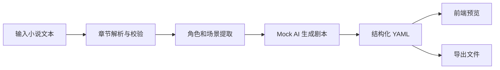

# 项目上下文与设计取舍

## 项目概述

Novel2Script 是一款 AI 辅助小说转剧本工具。它面向已经拥有小说文本、但缺少剧本改编经验或改编时间的创作者，帮助他们把 3 个章节以上的小说快速转换为结构化剧本 YAML，获得可编辑、可继续打磨的剧本初稿。

项目的核心价值不是替代编剧，而是降低改编第一步的门槛：把小说中分散的章节、叙述、人物和事件，整理成剧本所需的场景、角色、动作、对白、旁白和转场。

## 用户定位

### 小说作者

小说作者通常熟悉故事和人物，但未必熟悉剧本格式。工具需要帮助他们快速看到“我的小说如果变成剧本，会长什么样”，并允许后续人工修改。

### 编剧助理

编剧助理需要快速拆解文本、提炼场景、整理人物和对白。工具应优先提供结构化草稿，而不是只给一段不可编辑的自然语言总结。

### 内容团队

内容团队可能需要评估小说 IP 是否适合影视化、短剧化或互动叙事。工具应能快速生成可预览的结构化结果，便于内部讨论和二次加工。

## 核心使用场景

1. 用户准备一份包含 3 个章节以上的小说文本。
2. 用户上传 `.txt` / `.md` 文件，或直接粘贴文本。
3. 系统解析章节结构，并校验章节数量是否满足要求。
4. 系统识别主要角色、场景和基础情节节点。
5. 系统在 mock mode 下生成结构化剧本 YAML。
6. 用户在前端查看结构化预览。
7. 用户导出 YAML 文件，继续人工打磨或交给后续工具处理。

## MVP 边界

MVP 的目标是验证主链路是否成立，而不是一次性做完整剧本生产系统。

### MVP 必须包含

- 小说文本输入：支持 `.txt` / `.md` 上传或粘贴。
- 章节校验：输入必须包含 3 个章节以上。
- 基础解析：提取章节、角色、场景和情节信息。
- AI 生成：使用 `deepseek-v4` provider 抽象，但默认走 mock mode。
- YAML 输出：生成符合 Schema 的结构化剧本。
- 前端导出：支持一键导出 YAML。
- 错误处理：章节不足、格式错误、生成失败、导出失败都需要明确提示。
- 示例数据：提供可用于 demo 的输入和输出样例。

### MVP 暂不包含

- 真实大模型 API 接入。
- 多人协作编辑。
- 完整剧本编辑器。
- 多版本生成。
- 分镜生成。
- 复杂权限系统。
- 商业化账号体系。

这些能力重要，但它们依赖稳定的输出结构和主链路。过早投入会让 MVP 边界变重，影响交付节奏。

## 技术取舍

### 为什么后端使用 Golang

Golang 适合作为这个项目的后端基础：

- 启动快，部署简单，适合做轻量 API 服务。
- 标准库对 HTTP、文件处理和并发任务支持成熟。
- 类型系统清晰，适合维护结构化 YAML 输出契约。
- 后续接入异步生成、任务队列或文件导出服务时扩展空间足够。

MVP 阶段不需要复杂微服务，Golang 单体服务即可承载解析、mock 生成和导出。

### 为什么先做 mock mode

题目要求使用 `deepseek-v4` 作为 AI API 来源，但当前阶段不做真实大模型接入。先做 mock mode 有三个原因：

- 稳定主链路：demo 不受网络、额度、模型波动和密钥配置影响。
- 固化结构契约：先验证 YAML Schema 是否满足前端预览、导出和用户编辑。
- 降低调试成本：后端、前端、错误处理可以在可复现输出上快速迭代。

真实 AI API 接入应作为后续任务，在主链路和 Schema 稳定后进行。

### 为什么输出 YAML

YAML 同时适合人读和机器处理。对小说作者来说，YAML 比 JSON 更容易扫读和手动修改；对系统来说，YAML 又比纯文本更容易校验、预览和转换。

剧本 YAML 可以作为统一中间格式：

- 后端生成它。
- 前端预览它。
- 导出接口返回它。
- 示例文档展示它。
- 未来分镜、多版本和局部重生成继续扩展它。

### 为什么要定义 Schema

没有 Schema，AI 输出很容易变成不可控的自然语言。Schema 是产品契约，能把“生成剧本”拆成可验证的结构：

- `metadata` 说明来源、语言和生成模式。
- `source_chapters` 保留章节来源。
- `characters` 统一角色引用。
- `acts` 和 `scenes` 组织剧本结构。
- `beats` 表示动作、对白、旁白和转场。

这让前端和后端可以围绕同一结构工作，避免每个模块各自猜测输出格式。

## 主链路设计

主链路的判断标准是：用户可以从一份 3 章以上小说文本出发，稳定得到一份结构化 YAML 剧本初稿，并能在前端看懂、下载、继续编辑。

## 错误处理原则

错误提示需要面向作者，而不是只面向开发者。

- 章节不足：说明至少需要 3 个章节，并提示如何补充。
- 文件格式错误：说明当前支持 `.txt` / `.md`。
- 文本为空：提示用户上传文件或粘贴正文。
- 解析失败：说明系统没有识别到章节结构，并建议检查标题格式。
- 生成失败：提示用户重试，并保留已解析出的章节信息。
- 导出失败：提示用户稍后重试，不丢失当前生成结果。

## Demo 叙事

Demo 应该围绕真实痛点展开：

1. 作者有一份小说，但不知道如何开始改剧本。
2. 上传一份 3 章以上的文本。
3. 系统识别章节和主要内容。
4. 点击生成，mock mode 产出稳定的剧本 YAML。
5. 前端展示场景、角色、动作和对白。
6. 点击导出，获得可继续编辑的 YAML 文件。
7. 解释当前为什么使用 mock mode，以及后续如何接入真实 AI。

Demo 重点不是炫技，而是证明产品主链路清楚、输出结构可靠、作者知道下一步怎么打磨。

## 后续演进

### P1

- 结构化前端预览界面。
- 示例小说和示例 YAML。
- 更完整的错误处理。
- 主链路自动化验证。
- 更细的项目设计文档。

### P2

- 多版本生成。
- 分镜生成。
- 局部编辑和局部重生成。
- Markdown / JSON 等导出格式扩展。
- 更完整的 demo walkthrough。

## 成熟度判断

项目是否成熟，不只看“有没有调用 AI”，而看以下几点：

- 选题是否真实：小说作者确实需要改编初稿。
- MVP 是否准确：先做输入到结构化输出的闭环。
- UI 是否干净：用户不需要理解复杂 AI 参数。
- 主链路是否稳定：demo 和测试不依赖真实模型波动。
- 输出是否结构化：YAML 能被预览、校验和导出。
- 设计是否可解释：mock mode、Schema、Golang 和功能边界都有明确原因。
